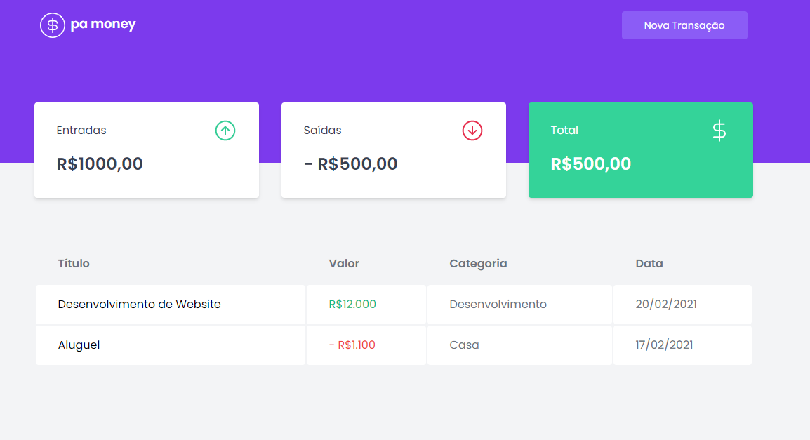

<p align="center">
  <h1 align="center">pamoney</h1>
  
  
  
  <p align="center">
    <br />
    <a href="https://pamoney.vercel.app">DEMO</a>
  </p>
  <p align="center">Uma forma de organizar suas financias pessoais!</p>
</p>

<h2>Sobre o projeto</h2>


Esse projeto foi feito com base no projeto de Capítulo 2 do Curso Ignite da Rocketseat. O intúito desse projeto é aperfeiçoar minhas habilidades com React e Typescript.

<h2>Dependências utilizadas</h2>

* [ReactJS](https://pt-br.reactjs.org)
* [Typescript](https://www.typescriptlang.org)
* [TailwindCSS](https://tailwindcss.com)
* [MirageJS](https://miragejs.com)
* [Axios](https://www.npmjs.com/package/axios)

## Inicializando o Projeto

### Instalação

1. Clone o repositório
   ```sh
   git clone https://github.com/palenquer/pamoney
   ```
2. Instale o pacote node
   ```sh
   npm install // yarn install
   ```
3. Rode o projeto no seu terminal
    ```sh
   npm start // yarn start
   ```
4. Abra o localhost indicado no seu navegador

### Pré-requisitos

Para rodar o projeto, é preciso a instalação do node na sua máquina.

* npm
  ```sh
  npm install npm@latest -g
  ```
